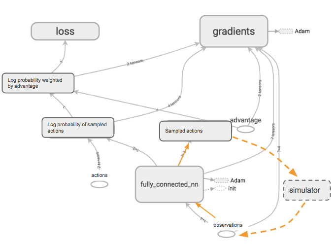
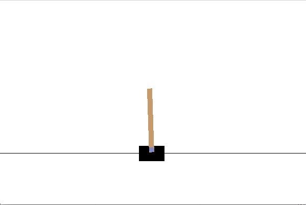
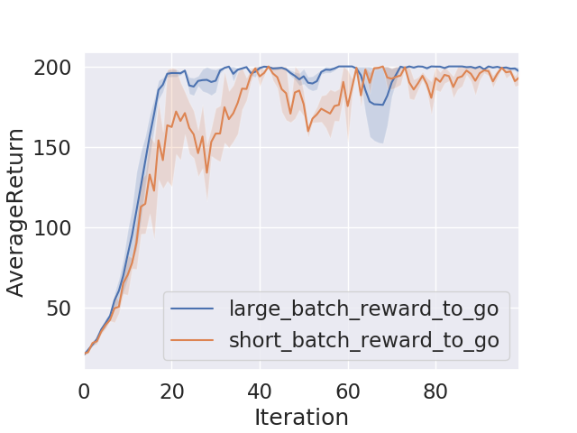

# CS294-112 HW 2: Policy Gradient

## Background
In this project, I implemented policy gradient algorithm for reinforcement learning and qualitatively compared four variants of it: adding reward to go (reward to go), normalize the reward (normalization), subtracting the reward by a simple baseline of the average (baseline) and a baseline that is predicted by a neural network (baseline_nn). The purpose of all these variants are to reduce the variance and improve the model.

## Method
Read `train_pg_f18.py` for implmentation of the model. 



The figure above illustrates the computational graph of the model. We run two types of loops on this graph, illustrated by the orange arrows and gray arrows. 

First is the orange loop, which involves both tensorflow and the simulator (dashed lines).  We feed an observation into our network which generates a distrbution of actions; we sample an action from the distribution. We execute that action in the simualator which in turn gives us a new observation and a reward. We repeat the cycle multiple times and collect the set of observations, actions and rewards.

Next, we move onto the gray loop. We feed the network with the data we just collected. This time, we know the reward, so we can use it to calculate the advantage and eventually the loss function. This way, we can backpropagate and update the variables in the neural network.

There is one more piece not shown in the above graph. Later on, we add one more component: instead of using the average as the baseline, we build a neural network to predict the reward given observation. The training data is the reward and observation we collected from the simulator so far.

Since the computational graph for this algorithm is more complex than the usual deep learning pipelines for supervised learning, here are some useful debugging tips:

* Be really careful about the tensor dimensions. Sometimes we will encounter silent failures when the dimension does not match but tensorflow does multiplication by broadcasting.
* For the tf.multinomial and tf.sparse_softmax_cross_entropy_with_logits, the arguments are _unscaled_ logit (which can range from -inf to +inf). So, if you are using those two functions, don't apply softmax on the last layer of the neural network!
* Watch out for the sign of the loss. log Pi * reward is to be _maximized_. Later, in the Adam optimizer, we asked it to minimize. In the discrete case, when we apply cross entropy on it, it is calculating - log Pi. So the two negation cancels out. In the continuous case, however, we do need to add a minus sign before the log probability for the term to be minimized.
* Unlike supervised learning, loss does not necessarily go down over time. In fact it likely goes up because as we perform better, the rewards go up and they weigh the samples more. See below for a plot of loss generated over the course of training. So we can't use the old trick to debug by overfitting on a small sample and checking loss going to zero. Instead, we should be monitoring the reward and expect to see it go up.


## Results

We first tested on the Cart-pole task. The goal is to move the cart in such a way that the pole does not fall down. See the gif for the learned behavior on our trained model:



Adding reward-to-go and normalization progressively improves the performance of the model as reflected by the larger average reward. Notice also how the variance shrinks too. In this simple task, using the neural network to predict reward (nn_baseline) is actually worse than simply using the average of the reward as the baseline (normalize).


```
python train_pg_f18.py CartPole-v0 -n 100 -b 1000 -e 3 -dna --exp_name sb_no_rtg_dna
python train_pg_f18.py CartPole-v0 -n 100 -b 1000 -e 3 -rtg -dna --exp_name sb_rtg_dna
python train_pg_f18.py CartPole-v0 -n 100 -b 1000 -e 3 -rtg --exp_name sb_rtg_na
python train_pg_f18.py CartPole-v0 -n 100 -b 1000 -e 3 -rtg --nn_baseline --exp_name sb_rtg_nn_baseline
```

Making the batch size larger (collect more samples from the simulator in between each training epoch) also makes the model to converge faster. Here, a small batch is 1000 runs and a large batch is 5000 runs.



'''
python train_pg_f18.py CartPole-v0 -n 100 -b 1000 -e 3 -rtg -dna --exp_name sb_rtg_dna
python train_pg_f18.py CartPole-v0 -n 100 -b 5000 -e 3 -rtg -dna --exp_name lb_rtg_dna
'''

However, the advantage diminishes in this task when we use reward-to-go along as normalization, as the small batch size (1000) already converges quite fast.


'''
python train_pg_f18.py CartPole-v0 -n 100 -b 1000 -e 3 -rtg --exp_name sb_rtg_na
python train_pg_f18.py CartPole-v0 -n 100 -b 5000 -e 3 -rtg --exp_name lb_rtg_na
'''

## Dependencies:
 * Python **3.5**
 * Numpy version **1.14.5**
 * TensorFlow version **1.10.5**
 * MuJoCo version **1.50** and mujoco-py **1.50.1.56**
 * OpenAI Gym version **0.10.5**
 * seaborn
 * Box2D==**2.3.2**

Before doing anything, first replace `gym/envs/box2d/lunar_lander.py` with the provided `lunar_lander.py` file.

See the [HW2 PDF](http://rail.eecs.berkeley.edu/deeprlcourse/static/homeworks/hw2.pdf) for further instructions.
