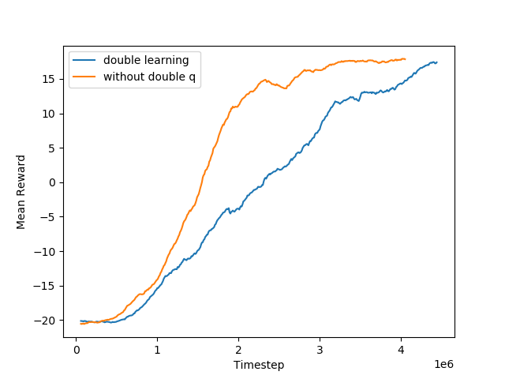

# CS294-112 HW 3: Q-Learning

## Q learning
In this project, I implemented Q learning (dqn.py) and compared two variants of it: with and without double Q learning.

Double Q learning results in higher rewards for the same number of episodes in the initial training. However, oddly, after ~800K steps, the double-q results are worse; and after 2.3m episodes, performance of the agent deteriorates.

Here is a qualitative result of the Pong game learned with Q learning at peak performance (green is the trained agent):

## Actor-Critic

For the second part of the project, I implemented the actor-critic algorithm (train_ac_f18.py). 

Here are the cartpole training results with different hyperparameters. To read the legend, the first number denotes the number of times we update the target network per training cycle, and the second number denotes the number of times we take the gradient step to update the critic network for each target network udpate.

## Dependencies:
 * Python **3.5**
 * Numpy version **1.14.5**
 * TensorFlow version **1.10.5**
 * MuJoCo version **1.50** and mujoco-py **1.50.1.56**
 * OpenAI Gym version **0.10.5**
 * seaborn
 * Box2D==**2.3.2**
 * OpenCV
 * ffmpeg

Before doing anything, first replace `gym/envs/box2d/lunar_lander.py` with the provided `lunar_lander.py` file.

The only files that you need to look at are `dqn.py` and `train_ac_f18.py`, which you will implement.

See the [HW3 PDF](http://rail.eecs.berkeley.edu/deeprlcourse/static/homeworks/hw3.pdf) for further instructions.

The starter code was based on an implementation of Q-learning for Atari generously provided by Szymon Sidor from OpenAI.
